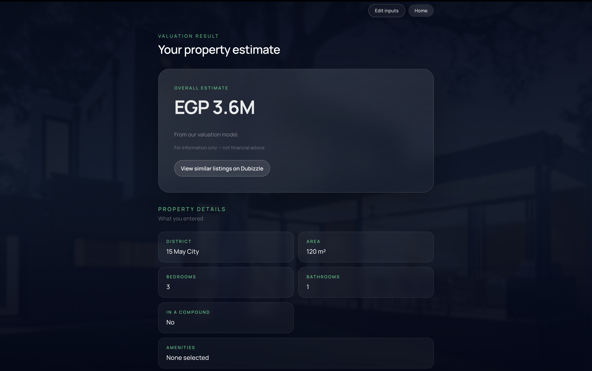

# Makanak 🏠

Machine learning-powered real estate valuation platform for the Egyptian market.

Makanak predicts apartment prices using a trained machine learning model, allowing users to estimate their property's value based on location, size, amenities, and other key features. The platform also generates similar Dubizzle listings for quick market comparison.

---

## 📸 Screenshots

### Hero Section

<p align="center">
  
</p>

### Property Details Form

<p align="center">
  
</p>

### Property Valuation Result

<p align="center">
  
</p>

### User Authentication

<p align="center">
  
</p>

---

## 🚀 Features

- 🤖 Machine learning-powered property price prediction
- 🏠 Multi-step property valuation form
- 🔐 User authentication (Sign up / Login)
- 💾 Save and manage previous valuations
- 🔍 Generate similar property listings on Dubizzle
- 🌍 Modern responsive React interface
- ⚡ RESTful Flask API

---

## 🧠 Machine Learning

The valuation engine is built using **HistGradientBoostingRegressor** from Scikit-learn.

### Model Highlights

- HistGradientBoostingRegressor
- Log-transformed target variable
- Feature engineering
- One-Hot Encoding for categorical features
- Monotonic constraints
- 5-Fold Cross Validation

### Features Used

- Area
- Bedrooms
- Bathrooms
- District
- Compound Status
- Amenities
- Engineered features (room density, amenity density, etc.)

---

## 🛠 Tech Stack

### Backend

- Flask
- Scikit-learn
- SQLite
- Joblib
- Pandas
- NumPy

### Frontend

- React (Vite)
- Fetch API
- CSS

---

## 📁 Project Structure

```text
Makanak/
│
├── makanak/          # React Frontend
├── makanak-api/      # Flask Backend + ML Model
└── README.md
```

---

# ⚙ Backend Setup

## 1. Navigate to backend

```bash
cd makanak-api
```

## 2. Create virtual environment

```bash
python3 -m venv .venv
```

## 3. Activate environment

### macOS / Linux

```bash
source .venv/bin/activate
```

### Windows

```bash
.venv\Scripts\activate
```

## 4. Install dependencies

```bash
pip install -r requirements.txt
```

If the requirements file is unavailable:

```bash
pip install flask joblib scikit-learn pandas numpy
```

## 5. Run the backend

```bash
python app.py
```

Backend runs on:

```
http://127.0.0.1:5050
```

---

# 💻 Frontend Setup

## 1. Navigate to frontend

```bash
cd makanak
```

## 2. Install packages

```bash
npm install
```

## 3. Start development server

```bash
npm run dev
```

Frontend runs on:

```
http://localhost:5173
```

---

# 🔗 API Endpoints

## Authentication

| Method | Endpoint |
|--------|----------|
| POST | `/auth/signup` |
| POST | `/auth/login` |
| POST | `/auth/logout` |
| GET | `/auth/me` |

## Prediction

| Method | Endpoint |
|--------|----------|
| POST | `/predict` |

## Saved Valuations

| Method | Endpoint |
|--------|----------|
| GET | `/valuations` |
| GET | `/valuations/:id` |

---

# 🧪 Example Prediction Request

```json
{
  "area_sqm": 190,
  "bedrooms": 3,
  "bathrooms": 2,
  "amenities_count": 6,
  "location_text": "Sheikh Zayed",
  "district": "Sheikh Zayed",
  "type": "Apartment",
  "ownership": "Primary",
  "furnished": "Yes",
  "payment_option": "Cash",
  "completion_status": "Ready"
}
```

---

# 🔍 Similar Listings

After every valuation, Makanak automatically generates a Dubizzle search URL using:

- Predicted price ±500,000 EGP
- Area ±20 m²
- Same district
- Same number of bedrooms
- Same number of bathrooms

This allows users to compare their estimated property value with current market listings.

---

# 📌 Notes

- This project was developed for academic purposes.
- Data was collected from publicly available Dubizzle apartment listings.
- Predictions represent estimated market values and should not be considered professional financial advice.
